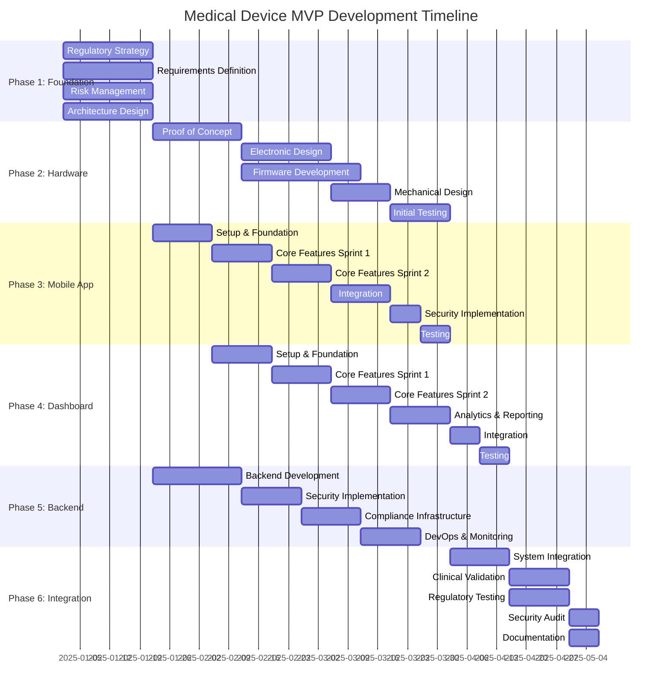
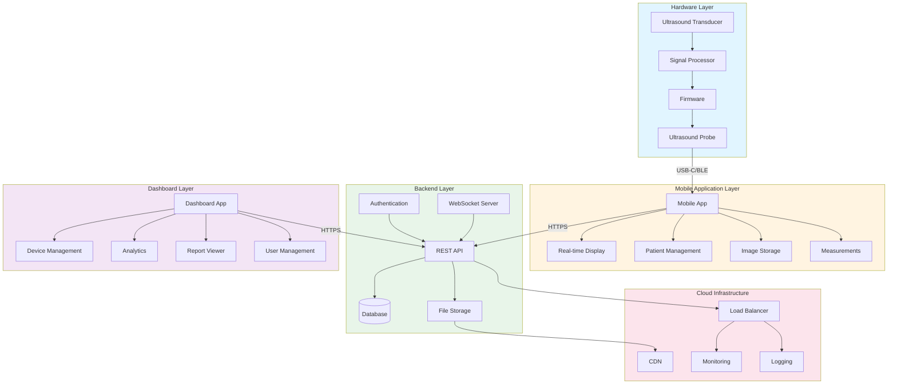
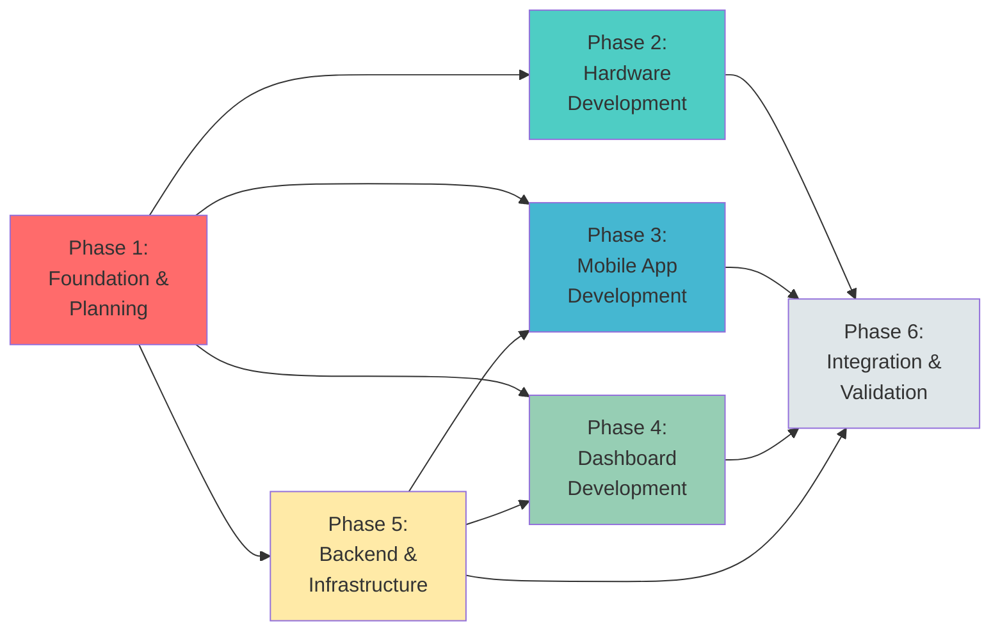
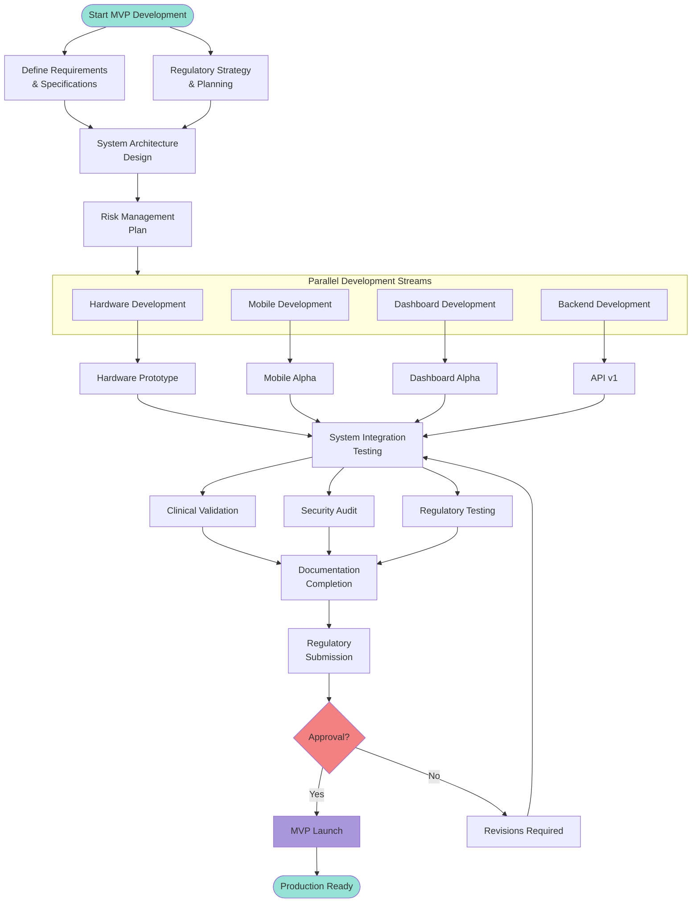
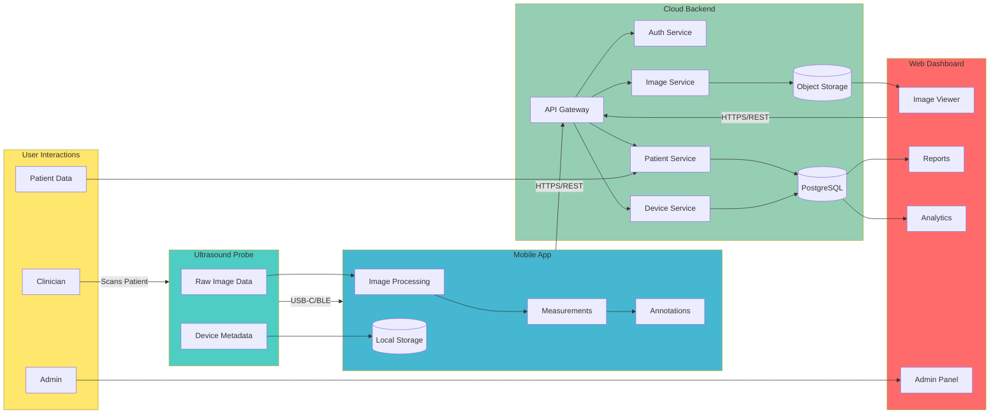
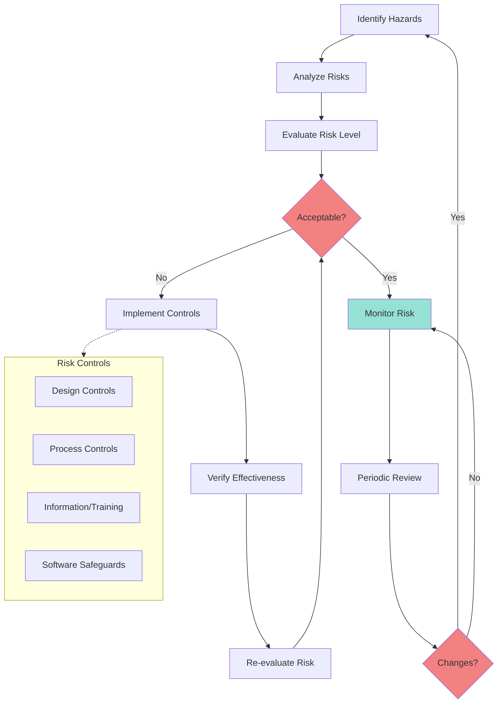
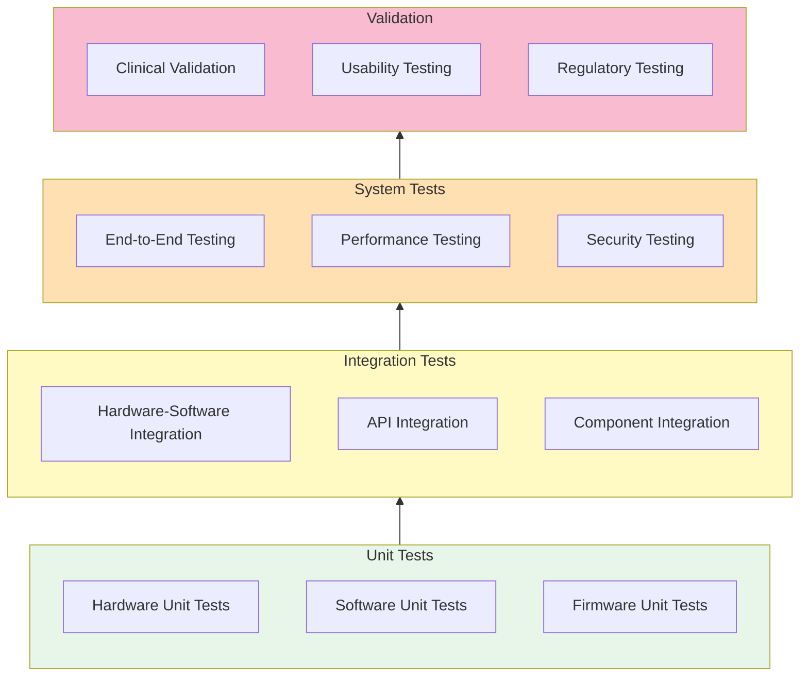
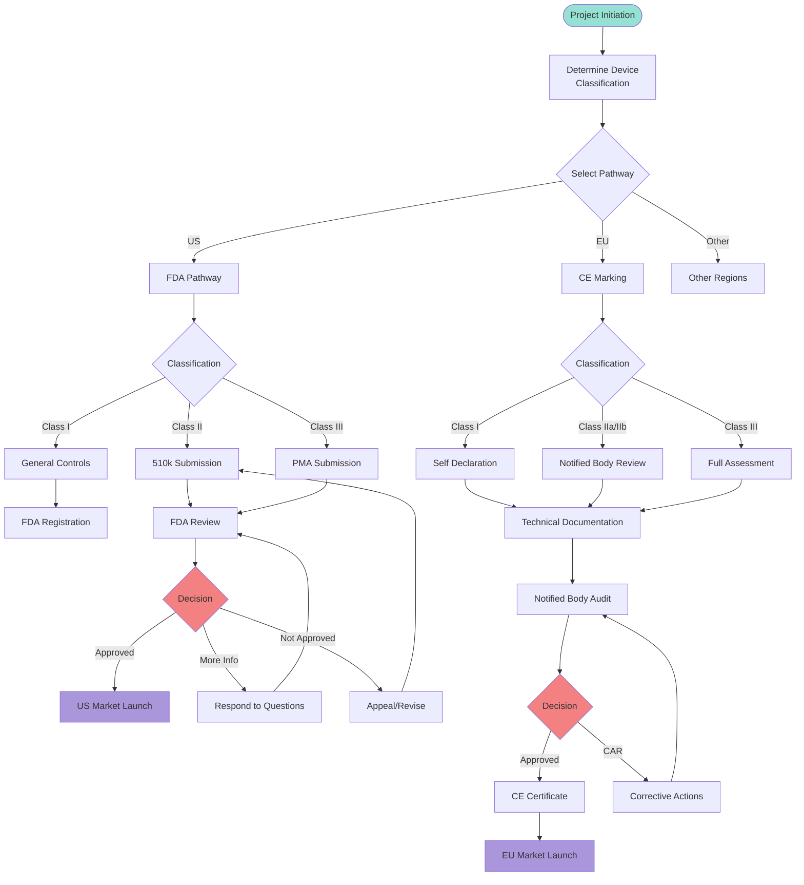
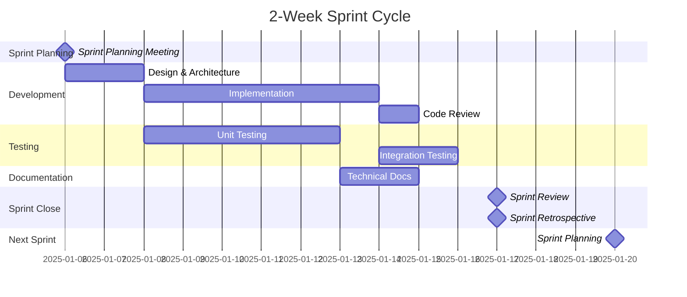

# Medical Device MVP Workflow Diagrams

## Overview Timeline (Gantt Chart)



## System Architecture Flow



## Phase Dependencies



## Development Workflow Process



## Data Flow Diagram



## Risk Management Flow



## Testing & Validation Pyramid



## Regulatory Pathway



## Sprint Structure (Agile)



---

## How to View These Diagrams

### Option 1: GitHub
- Push this file to GitHub and view it there (GitHub renders Mermaid)

### Option 2: VS Code
- Install "Markdown Preview Mermaid Support" extension
- Open this file and use preview (Cmd+Shift+V)

### Option 3: Online Viewers
- Copy diagram code to: https://mermaid.live/
- Or use: https://mermaid.ink/

### Option 4: Generate Images
```bash
# Install mermaid-cli
npm install -g @mermaid-js/mermaid-cli

# Generate PNG images
mmdc -i workflow-diagram.md -o workflow-diagram.png
```
